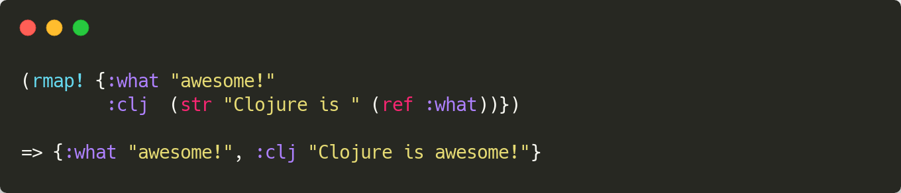

[](https://clojars.org/functionalbytes/rmap)
[](https://cljdoc.org/d/functionalbytes/rmap/CURRENT)
[](https://github.com/aroemers/rmap/actions?query=workflow%3A%22Clojure+CI%22)
[](https://clojars.org/functionalbytes/rmap)
[](https://functionalbytes.nl/clojure/rmap/2020/06/04/rmap-2.html)

# ➰ rmap

A Clojure library for recursive maps.



## An appetizer

This library allows you to create a recursive maps, i.e. maps with entries that can point to other entries in the same map.
See for yourself!

```clj
;; They can be created literally:

(rmap! {:foo 1
        :bar (ref :foo)})

;; Or, using plain data:

(rmap! {:foo 1
        :bar #rmap/ref :foo})

;; Or, programmatically:

(valuate! {:foo 1
           :bar (rval (ref :foo))})
```

In all cases, the result is the same:

```clj
{:foo 1, :bar 1}
```

Read on to see how this all works.

## Detailed usage

### The RVal object

We start with a basic building block: a recursive value.
A recursive value is an unevaluated expression, which has access to the associative datastructure - i.e. a map or a vector - it will be evaluated in.
The expression can access other entries in this datastructure using the `ref` function.

A recursive value is represented in the form of an RVal object.
You can create an RVal using the `rval` macro.
It simply takes one or more expressions as its body.
Let's create a simple Clojure map with an RVal object in it and print it:

```clj
(def my-map
  {:foo 1
   :bar (rval (inc (ref :foo)))})

my-map
;=> {:foo 1, :bar ??}
```

As you can see, the `:bar` entry is an RVal and uses the `ref` function to fetch the value mapped to `:foo`.
You can also see that no evaluation has taken place.

There is a complementary macro, called `rmap`.
It lets you create a datastructure from a literal representation, where all values are automatically RVal objects.
For example, the following creates a similar map, except that the `:foo` value is now also an RVal:

```clj
(def my-map
  (rmap {:foo 1
         :bar (inc (ref :foo))}))

my-map
;=> {:foo ??, :bar ??}
```

The `ref` function is only bound during the evaluation of the recursive value, as that is the only moment it makes sense to use it.
If you want to use it at a later point, you should bind it locally.
For example when using a delay:

```clj
(rmap {:foo 1
       :bar (inc (ref :foo))
       :baz (let [my-ref ref]
              (delay (my-ref :bar)))})
```

### Valuating

To evaluate one or more RVal objects in a particular context, you can use the `valuate!` function.
It takes an associative datastructure and returns an updated version of it, where all RVal objects are evaluated.
A similar function is `valuate-keys!`.
It does the same, but only evaluates the specified keys (or indices) and their dependencies.

Let's evaluate the map we created earlier:

```clj
(valuate! my-map)
;=> {:foo 1, :bar 2}

my-map
;=> {:foo ??, :bar ??}

(valuate-keys! my-map :foo)
;=> {:foo 1, :bar ??}

(valuate! (assoc my-map :foo 1001))
;=> {:foo 1001, :bar 1002}
```

You can see that the entries are evaluated now, yielding the expected results.
Each entry is only evaluated once, even if an entry is requested multiple times by other entries.
Also note that the original map itself has not changed and can be modified, yielding different results.

### Plain data recursive maps

There are three slightly more advanced features related to valuating.

Firstly, when an RVal is evaluated, the library post-processes the result by walking through it.
Whenever a `#rmap/ref <key>` (a tagged litteral, handled by `rmap.core/ref-tag`) is encountered during this walk, it will be replaced with the value under the referenced key.
This way you can create recursive maps using plain data, by reading from an EDN file for example.

Secondly, to create a recursive map from an already existing map, you can also use `rmap`.
The resulting map has all values wrapped in an `rval`.

And thirdly, the `valuate!` function takes an optional extra parameter.
The extra parameter is a function that post-processes the evaluation result of an RVal (after the post-processing of the `#rmap/ref` tagged literal).
The function receives a `clojure.lang.MapEntry` and should return a value.
The default is Clojure's `val`.
This way you can turn plain data into something else for example.

Let's combine these three features in an example:

```clj
(def my-data-map {:foo 1 :bar #rmap/ref :foo})
;=> {:foo 1, :bar #rmap/ref :foo}

(def my-rmap (rmap my-data-map))
;=> {:foo ??, :bar ??}

(valuate! my-rmap (comp inc val))
;=> {:foo 2, :bar 3}
```

### Putting it all together

As you've seen in the appetizer, there is also a convenience macro called `rmap!`.
This is the same as `rmap`, but it is instantly valuated.
For example:

```clj
(rmap! {:foo 1
        :bar (inc (ref :foo))
        :baz (inc (ref :bar))})
;=> {:foo 1 :bar 2 :baz 3}
```

Maybe this `rmap!` is all you need for your purposes.
The other macros and functions are provided to give you all the tools you might need.
This way the rmap library aims to be both simple and easy.

_That's it. Enjoy!_ 🚀

## License

Copyright © 2014-2023 Functional Bytes

Distributed under the Eclipse Public License either version 1.0 or (at
your option) any later version.
